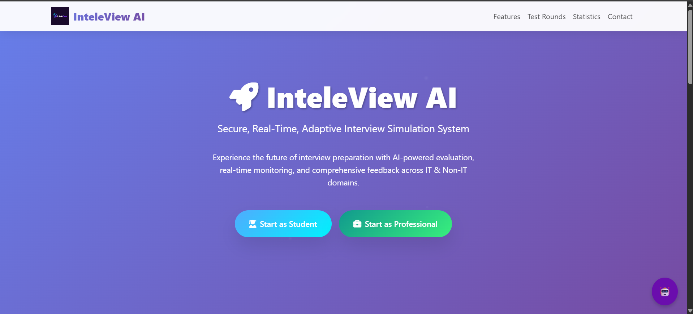

# 🤖 InteleView AI

### Real-Time, Secure & Adaptive Interview Simulation Platform

*For IT & Non-IT Students, Freshers, and Professionals*




---

## 🚧 Project Status (Important)

⚠ **Not Deployed Yet**
⚠ **GD Round – Partially Completed**
⚠ **Resume Analysis – Not Completed**
⚠ **HR Round – Not Completed**

> This project is currently under **active development**.
> Core interview flows, aptitude & technical rounds, monitoring, and analytics are implemented.
> Resume analysis, GD, and HR modules are under incremental enhancement.


---

## 🌟 Project Overview

**InteleView AI** is a next-generation, AI-powered mock interview platform designed to simulate **real-world hiring processes** used in **campus placements, corporate interviews, and exams like TCS NQT**.

It delivers a **controlled interview environment** with AI-driven questions, real-time monitoring, adaptive difficulty, and instant performance analytics—helping candidates **practice smarter, not harder**.

---

## 🎯 Why InteleView AI?

Traditional mock interview platforms lack:

* Real interview pressure
* Continuous monitoring
* Adaptive intelligence
* Meaningful analytics

**InteleView AI bridges this gap** using **AI + monitoring + data-driven evaluation**.

---

## 🧠 Key Capabilities

* 🧪 Real interview environment simulation
* 🧠 AI-based question generation & evaluation
* 👀 Webcam monitoring & tab-switch detection
* 📊 Instant feedback & improvement analytics
* 🔐 Secure role-based access
* 🚀 Designed for high concurrency (1000+ users)

---

## 👥 User Modes

### 🎓 Student

* Campus placement practice
* Aptitude & technical preparation
* HR & behavioral rounds *(in progress)*

### 💼 Professional

* Experience-based technical interviews
* HR & behavioral rounds *(in progress)*


---
### 📄 Resume Analysis Module

| Feature                    | Status      |
| -------------------------- | ----------- |
| Resume Upload              | ✅ Completed |
| Basic Parsing (PDF/DOCX)   | ✅ Completed |
| Skill & Keyword Extraction | 🟡 Partial  |
| AI Feedback & Scoring      | 🟡 Partial  |
| Job Match Recommendation   | 🔴 Planned  |

---


## 🧩 Interview Rounds

| Round                        | Status      | Screenshots                                                                                                              |
| ---------------------------- | ----------- | ------------------------------------------------------------------------------------------------------------------------ |
| 🧮 **Aptitude**              | ✅ Completed | [View 1](assets/aptitude1.png) · [View 2](assets/aptitude2.png)                                                          |
| 💻 **Technical**             | ✅ Completed | [Test](assets/technical1.png) · [Result](assets/technical_result_page.png) · [Completed](assets/tech_completed_test.png) |
| 🗣 **Group Discussion (GD)** | 🟡 Partial  | [View 1](assets/GD1.png) · [View 2](assets/gd2.png)                                                                      |
| 🧑‍💼 **HR**                 | 🔴 Pending  | To be implemented                                                                                                        |

---

## ⚙️ Technology Stack

### 🌐 Frontend

* HTML, CSS, JavaScript
* Bootstrap (Responsive UI)

### 🧠 Backend

* Python (Django)
* Django REST Framework

### 🤖 AI & Intelligence

* HuggingFace Transformers
* Local NLP Models

### 🎥 Monitoring

* OpenCV (Webcam)
* WebRTC
* Web Speech API

### 🗄️ Database

* MongoDB Atlas

### 🔐 Security

* JWT Authentication
* CSRF Protection
* HTTPS Ready
* Tab-switch & focus detection

---

## 🖥️ Major Features

* Adaptive AI question engine
* Resume upload with NLP-based analysis *(partially implemented)*
* MCQ, subjective, coding & voice questions
* Cheating & violation detection
* Admin analytics dashboard
* Re-attempt with reshuffled questions

---

## 📊 Admin Dashboard

* 👥 User & session monitoring
* 📈 Performance analytics
* 🔍 Violation tracking
* 📑 Question management

📸 Preview → [Admin Panel](assets/admin_panel_full.png)

---

## 🤖 Bot & User Utilities

* 💬 AI Help Bot → [View](assets/Bot_Chat.png)
* ⚙ Settings (Full) → [View](assets/setting_full.png)
* ⚙ Settings (Partial) → [View](assets/setting1.png)
* 👤 Profile / Contact → [View](assets/contact.png)

---

## 🖼️ Screenshots Gallery

All screenshots are stored in the [`assets/`](assets/) folder.

### 🔐 Authentication

| Screen        | Link                           |
| ------------- | ------------------------------ |
| Admin Login   | [View](assets/admin_login.png) |
| User Login    | [View](assets/login.png)       |
| User Register | [View](assets/register.png)    |

### 🏠 Landing Pages

| Screen      | Link                        |
| ----------- | --------------------------- |
| Landing – 1 | [View](assets/landing1.png) |
| Landing – 2 | [View](assets/landing2.png) |
| Landing – 3 | [View](assets/landing3.png) |
| Footer – 4 | [View](assets/landing4.png) |

### 🎓 Student Area

| Screen               | Link                                       |
| -------------------- | ------------------------------------------ |
| Student Dashboard    | [View](assets/student_dashboard.png)       |
| Interview Round Page | [View](assets/student_interview_round.png) |

### 📈 Results & Analysis

| Screen               | Link                                                |
| -------------------- | --------------------------------------------------- |
| Performance Analysis | [View](assets/performance_analysis_tech_result.png) |
| Aptitude Warning     | [View](assets/warning_aptitude.png)                 |

---


## 📁 Project Structure

```
InteleView-AI/
│
├── .vscode/                     # VS Code editor configuration
│
├── admin_panel/                 # Custom admin dashboard & controls
│
├── aptitude/                    # Aptitude round logic, views & APIs
│
├── chatbot/                     # AI helper bot (chat assistance)
│
├── dashboard/                   # User dashboards (student/professional)
│
├── feedback/                    # Interview feedback & evaluation reports
│
├── GD/                          # Group Discussion module (partially completed)
│
├── inteleview_core/             # Core project settings (settings.py, urls.py, wsgi.py)
│
├── landing/                     # Landing page, home UI, public views
│
├── media/                       # Uploaded media files (resumes, recordings)
│
├── myvenv/                      # Python virtual environment (local only)
│
├── resumes/                     # Uploaded resumes for NLP analysis
│
├── static/                      # Project static files (CSS, JS, images)
│
├── staticfiles/                 # Collected static files (for deployment)
│
├── technical/                   # Technical interview round logic
│
├── testsystem/                  # Test engine, attempt handling, scoring
│
├── users/                       # User authentication, roles & profiles
│
├── .env                         # Environment variables (DO NOT COMMIT)
├── .env.example                 # Sample environment configuration
│
├── .gitignore                   # Git ignored files
│
├── Final Project Title.txt      # Project title & description reference
│
├── aptitude_questions.json      # Aptitude question bank
│
├── technical_mcq.json           # Technical MCQ questions
│
├── updated_mcq_questions.json   # Updated/extended MCQ set
│
├── manage.py                    # Django project entry point
│
├── pyrightconfig.json           # Python type-checking configuration
│
├── requirements.txt             # Python dependencies
│
└── README.md                    # Project documentation

```

---

## 🚀 Installation & Setup

```bash
git clone https://github.com/your-username/InteleView-AI.git
cd InteleView-AI
python -m venv venv
source venv/bin/activate
pip install -r requirements.txt
cp .env.example .env
python manage.py migrate
python manage.py runserver
```

### 🔐 Create the Superuser (Admin)

```bash
python manage.py createsuperuser
```

Then login at:
👉 [http://127.0.0.1:8000/admin/](http://127.0.0.1:8000/admin/)

---

## 🧪 Python Version

* **Python 3.9.10**

---

## 🔮 Future Enhancements

* Complete HR & GD rounds
* AI voice-based interviewer
* Emotion & confidence detection
* Company-specific interview packs
* Mobile app integration

---

## 📬 Contact & Collaboration

📧 **Email:** [mohamedfirose59@gmail.com](mailto:mohamedfirose59@gmail.com)
💬 Happy to explain architecture, AI flow, or roadmap.
⭐ If you like this project, please **star the repository**!

---

> **InteleView AI is a continuously evolving interview intelligence platform.**

